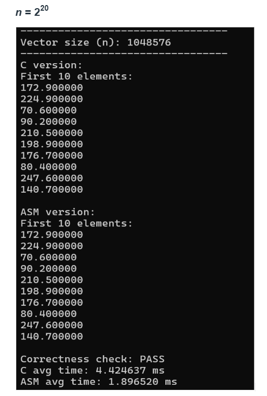
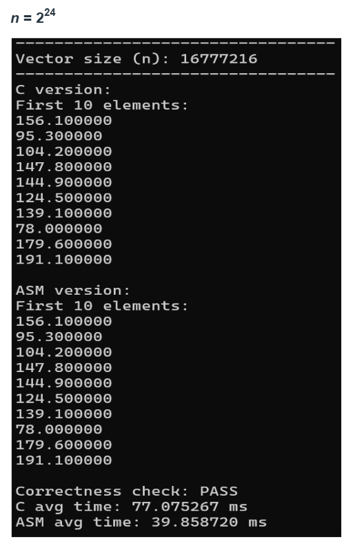
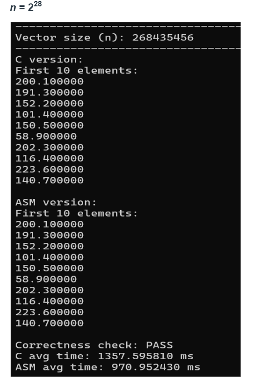
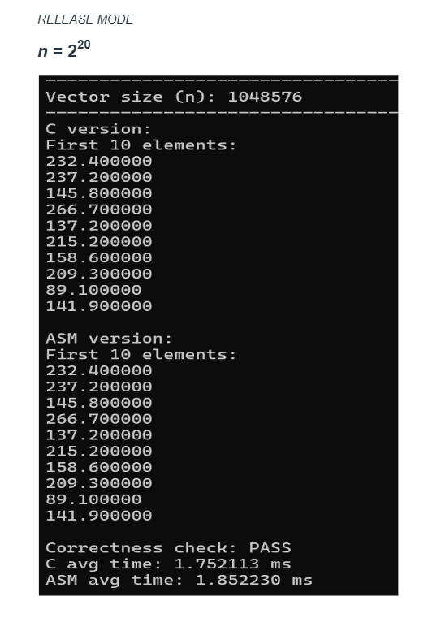
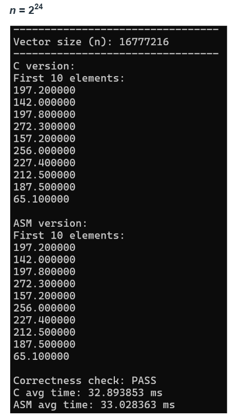
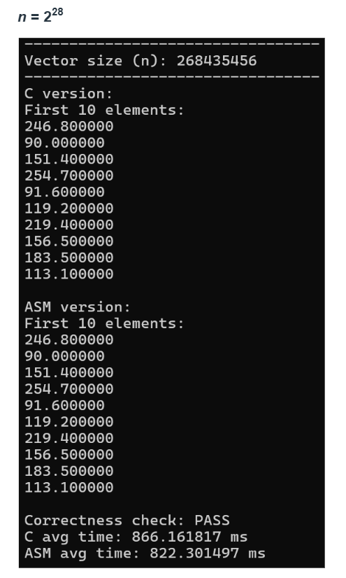

# LBYARCH - DAXPY (C and x86-64 Assembly)

## Contributors
 
- **BENDOL, Trisha Mae R.**
- **CAMATO, Karl Kristoffer R.**

## Video Demo
Link: 

## What this project does
This program implements DAXPY (Z[i] = A * X[i] + Y[i]) in two versions:
1. A plain C kernel (`daxpy_c`)
2. An x86-64 assembly kernel using scalar SIMD instructions (`daxpy`, written in NASM)
Both versions are called from the same C main program. The C version is used as the "answer key" to check if the assembly version is computing the correct result.

## Files
- `daxpy.c` - contains the C kernel, main program, timing, and correctness check
- `daxpy.asm` - contains the assembly kernel using scalar SIMD (movsd, mulsd, addsd)

## Results

### Debug Mode

| Size (n) | C avg time (ms) | ASM avg time (ms) |
|---|---|---|
| 1,048,576 (2^20) | 4.42 | 1.90 |
| 16,777,216 (2^24) | 77.08 | 39.86 |
| 268,435,456 (2^28) | 1357.60 | 970.95 |
 
Correctness check: PASS for all sizes

### Release Mode
 
| Size (n) | C avg time (ms) | ASM avg time (ms) |
|---|---|---|
| 1,048,576 (2^20) | 1.75 | 1.85 |
| 16,777,216 (2^24) | 32.89 | 33.03 |
| 268,435,456 (2^28) | 866.16 | 822.30 |
 
Correctness check: PASS for all sizes

## Analysis
From here, the results show that both C and x86-64 assembly versions are working correctly, because the correctness check passed for all vector sizes. 

For Debug mode, the assembly version was faster than the C version in all tests, because Debug mode doesn't apply many compiler optimizations, so C just runs less efficiently, while the assembly version on the other hand directly uses scalar SIMD instructions (like 'MOVSD', 'MULSD', 'ADDSD'), helping it perform better.

Now, for Release mode, the difference between the C and assembly versions became smaller. The C compiler this time now applies optimizations during Release mode, which improves the C kernel's performance, and so allows it to match or even perform better than the assembly version in some cases.

For bigger vector sizes, we can also see that both versions take more time because they need to process and move more data. At this point, performance is affected not only by the calculations, but also by how fast the data can be accessed from memory.

Overall, the x86-64 assembly version met the requirements by using scalar SIMD instructions and also showed good performance, especially in Debug mode. But, the Release mode results show that optimized C code can also perform very well compared to manually written assembly.
 
## Screenshots
 
### Debug Mode Output
Size: 2^20

Size: 2^24

Size: 2^28

----

### Release Mode Output
Size: 2^20

Size: 2^24

Size: 2^28

 
